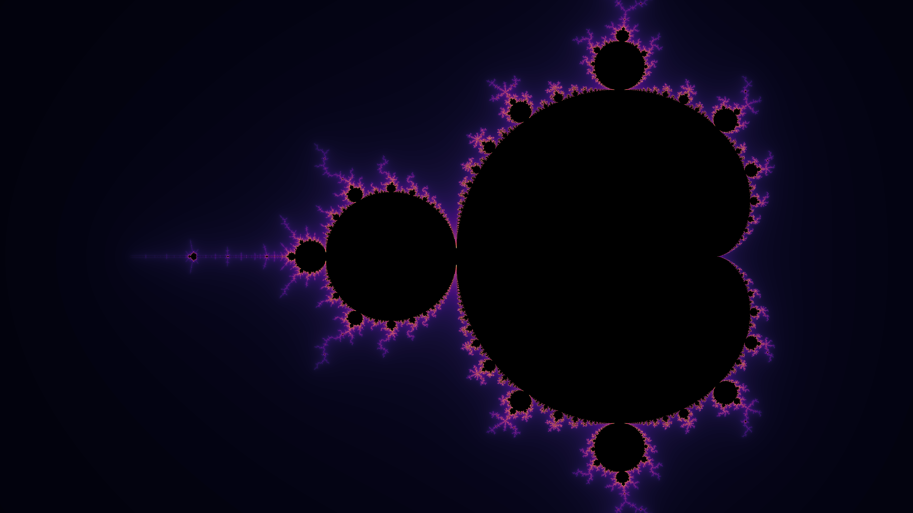

# Mandelbrot

[](https://github.com/matthew-james-laidlaw/Mandelbrot/actions/workflows/unit.yml)

A command line tool for visualizing the Mandelbrot set. Generates .png images. Written in C++20.



## Usage

```
# configure & build
cmake --preset release
cmake --build --preset release
```

```
Usage: mandelbrot [--help] [--version] [--colormap (magma|twilight|viridis)] output

Positional arguments:
  output                                   Path for the .png file to be saved

Optional arguments:
  -h, --help                               shows help message and exits
  -v, --version                            prints version information and exits
  -c, --colormap (magma|twilight|viridis)  Which color palette to use: magma, twilight, or viridis [default: "magma"]
```

```
# example (windows)
.\build\release\bin\Release\mandelbrot.exe mandelbrot.png --colormap magma
```

## About

The `mandelbrot` CLI tool allows users to specify an output filepath, and one of a few colormaps, to save a 4k image of the Mandelbrot set. The Mandelbrot calculation is implemented as a per-pixel kernel that is dispatched over a matrix of pixels using my [tensor library](https://github.com/matthew-james-laidlaw/Tensor). The tool automatically divides work evenly across all available threads. Generic and SSE implementions of the Mandelbrot kernel are provided, with a NEON implementation in the works. The SIMD kernel is selected automatically on supported hardware, but falls back to generic if it is not supported.

This tool was written as an integration test for the previously mentioned tensor library, showcasing how it can provide out-of-the box threading boosts with no action needed, and how it provides an easy-to-use container for storing N-dimensional data.

## Future Work

- Implement NEON Mandelbrot calculation.
- Benchmark between generic/SSE/NEON implementations and different threading configurations.

# Resources
* [Mandelbrot Plotting Algorithms](https://en.wikipedia.org/wiki/Plotting_algorithms_for_the_Mandelbrot_set#Continuous_(smooth)_coloring)
* [CMake Project Structure Convention](https://cliutils.gitlab.io/modern-cmake/chapters/basics/structure.html)
